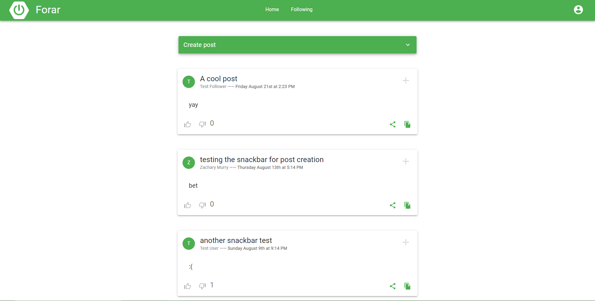
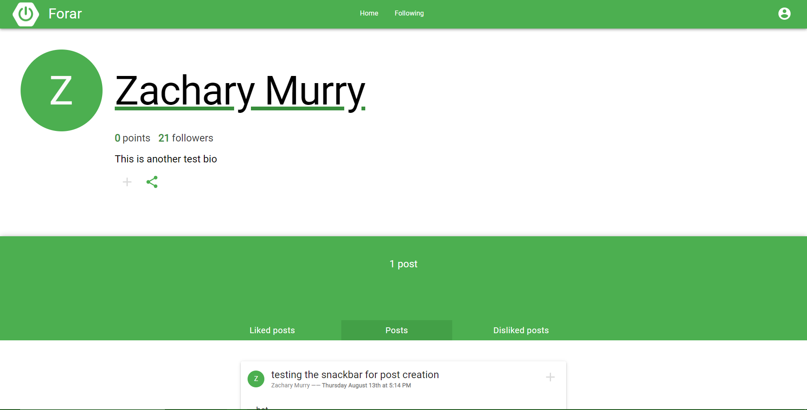
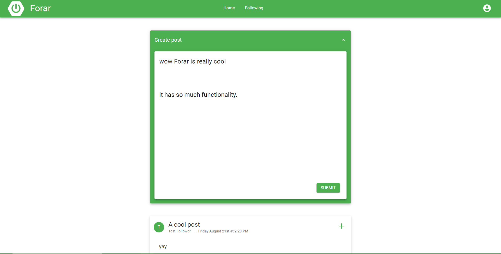
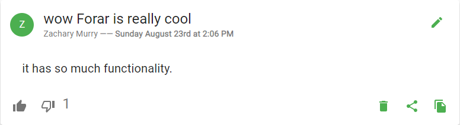

# forar
A platform where you can share your thoughts through posts and comments.

## about
Forar is a simple social media site with posts, accounts, following, and liking. 

You can click on users to see their profile page.

On the home page, you can sign in and create your own posts.

## technologies
The frontend was made with React, which calls a Java Spring backend, which connects to a PostgreSQL database.
